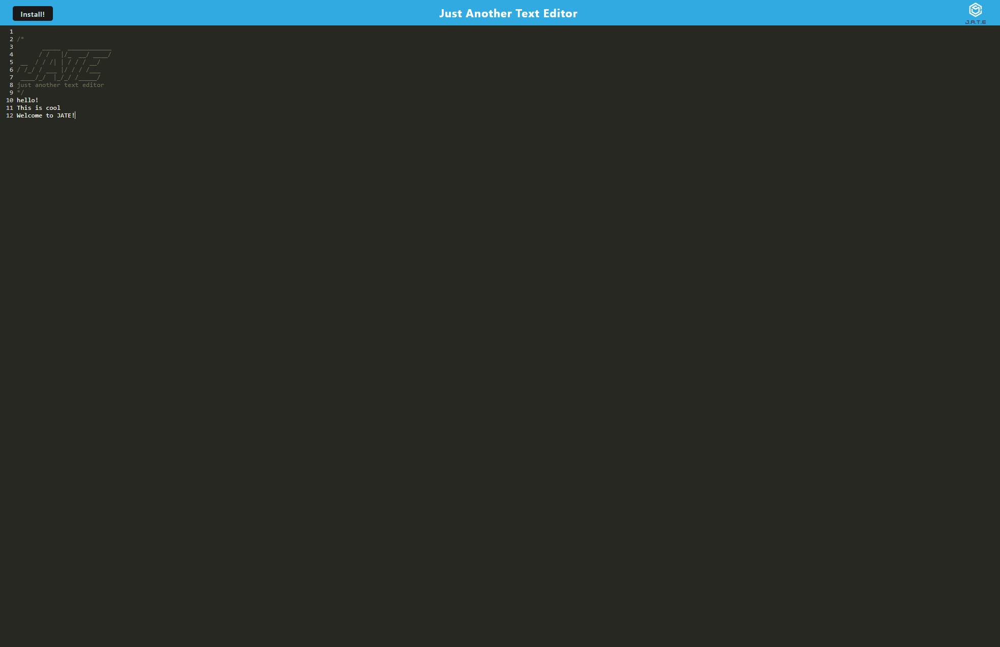

# Editor of Text (J.A.T.E)

Welcome to your new text editor that has offline capabilities! 

## Description

This application uses PWA, or progressive web app, to make sure that even if you aren't online, you can always leave a note. Wether it's a simple grocery list, or work tasks, JATE has you covered. 

## Installation 

1. Clone Repo:
 - git clone https://github.com/GrindBoiWes/editor-of-text.git

2. Install the NPM packages
 - run npm i inside of your terminal

3. Start the application
 - run npm start inside of your terminal

## Images

## License
There is no license attatched to this project

## Links

Deployed Heroku app @ https://editor-of-text.herokuapp.com/

